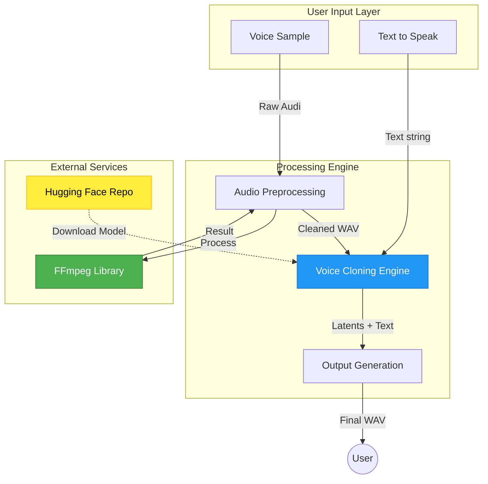

# System Architecture

## High-Level Architecture

The following diagram illustrates the high-level architecture of the Voice Cloning System, fully compatible with Mermaid v8.8.0.

## Component Overview

### 1. User Input Layer
- **Text Input**: The target text to be synthesized.
- **Voice Sample Input**: A reference WAV/MP3 file providing voice characteristics.

### 2. Audio Preprocessing Module
Optimizes the voice sample for the XTTS model.
- **Dependencies**: `pydub`, `FFmpeg`.
- **Operations**: Mono conversion, Resampling (22050Hz), Normalization, Compression, Silence Trimming.

### 3. Voice Cloning Engine (XTTS v2)
The core logic using Coqui TTS.
- **Model Loading**: Fetches `xtts_v2` weights from Hugging Face.
- **Inference**: Computes speaker latents and generates mel-spectrograms.

### 4. Output Generation
- **Synthesis**: Converts spectrograms to waveform.
- **Export**: Saves as `.wav` file.
