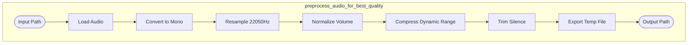
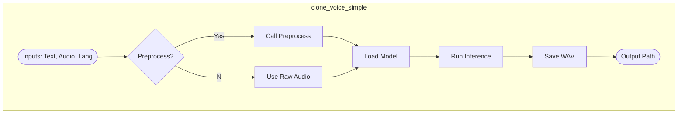
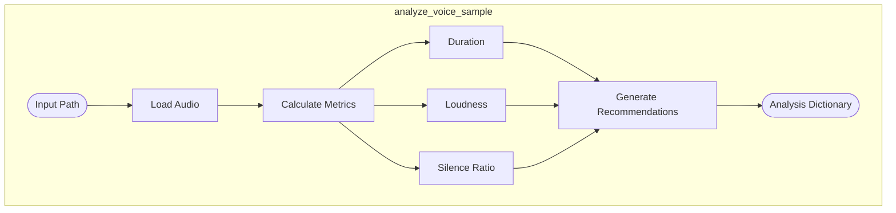
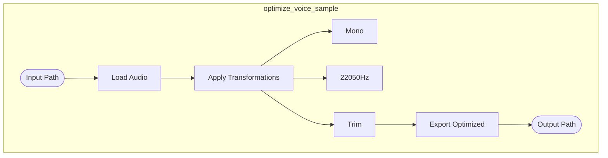
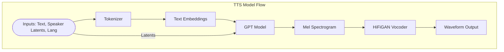

# Data Flow Diagrams

This document details the data flow for the core functions of the voice cloning system.

## 1. Preprocess Audio
**Function**: `preprocess_audio_for_best_quality()`

## 2. Clone Voice (Simple)
**Function**: `clone_voice_simple()`

## 3. Analyze Voice Sample
**Function**: `analyze_voice_sample()`

## 4. Optimize Voice Sample
**Function**: `optimize_voice_sample()`

## 5. TTS Model Component
**Component**: internal TTS Model Logic

