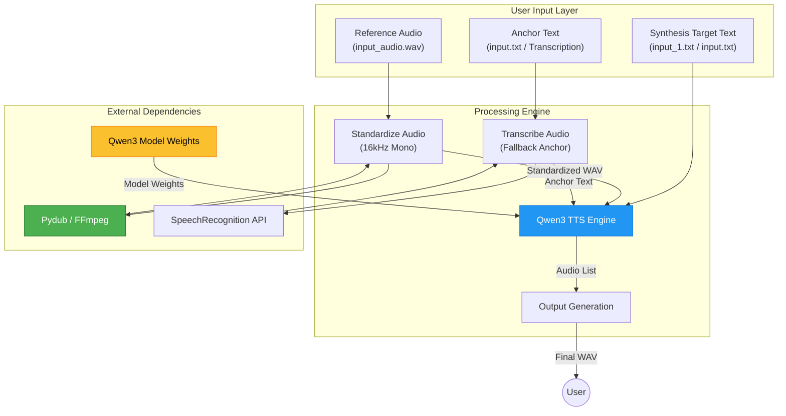

# System Architecture

## High-Level Architecture

The following diagram illustrates the high-level architecture of the Voice Cloning System, using Mermaid v8.8.0.

## Component Overview

### 1. User Input Layer
- **Synthesis Target**: The text to be spoken. Sourced from `input_1.txt` (priority) or `input.txt` (fallback).
- **Anchor Text**: Describes the content of the reference audio. Used for In-Context Learning (ICL) to improve cloning quality. Sourced from `input.txt` or automatic transcription.
- **Reference Audio**: High-quality voice sample providing the target timbre and style.

### 2. Audio Standardization Module (`standardize_audio`)
Optimizes the voice sample for the Qwen3 model.
- **Specifications**: Mono, **16,000Hz** sample rate.
- **Operations**: Normalization, Dynamic Range Compression, and Silence Trimming.

### 3. Voice Cloning Engine (Qwen3 TTS)
Strict neural synthesis using the `Qwen/Qwen3-TTS-12Hz-0.6B-Base` model.
- **ICL Mode**: Uses the anchor text and reference audio for high-fidelity zero-shot cloning.
- **X-Vector Fallback**: If anchor text is unavailable, the model falls back to embedding-only synthesis.

### 4. Output Generation
- **Synthesis**: Generates audio lists via the Qwen3 inference pipeline.
- **Export**: Saves final standardized output to `../output/output_audio.wav` using `soundfile`.
