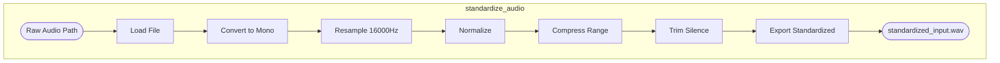
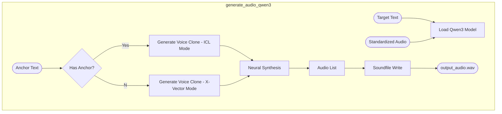
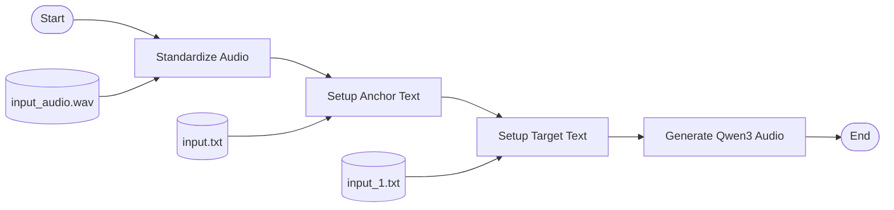

# Data Flow Diagrams

This document details the data flow for the core functions of the Qwen3-based voice cloning system.

## 1. Standardize Audio
**Function**: `standardize_audio()`

## 2. Generate Audio (Qwen3)
**Function**: `generate_audio_qwen3()`

## 3. Main Pipeline Flow
**Function**: `main()`

