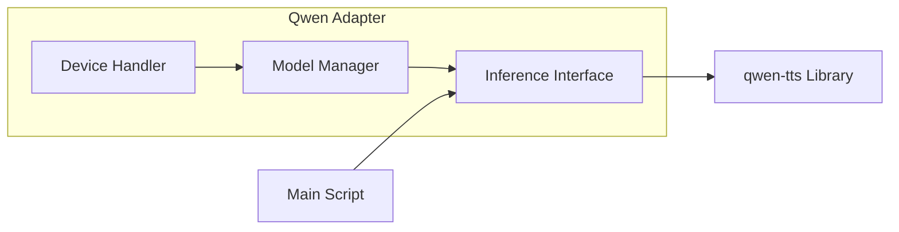

# Qwen Adapter Component

The Qwen Adapter acts as the primary interface between the system's core logic and the external `qwen-tts` library. It abstracts the complexities of model initialization, device management (CPU/CUDA), and inference API calls.

## Component Diagram

## Responsibilities
- **Model Initialization**: Loads pre-trained weights from Hugging Face or local cache.
- **Resource Management**: Detects CUDA availability and maps the model to the appropriate device.
- **API Standardisation**: Wraps the `generate_voice_clone` call to provide a consistent internal interface.
- **Error Handling**: Gracefully catches OOM or CUDA initialization errors and reports them to the system logger.
