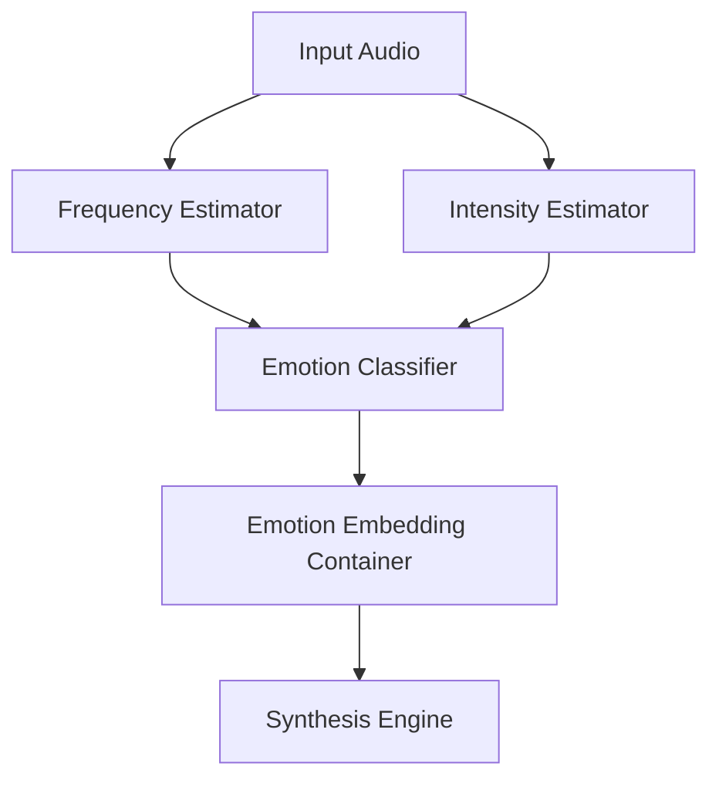

# Emotion Detector Component

The Emotion Detector analysis the reference audio sample to extract prosodic features that correlate with emotional states (e.g., pitch variance, intensity, speech rate).

## Component Diagram

## Responsibilities
- **Prosodic Analysis**: Extracts Fundamental Frequency (F0) and Energy contours.
- **Classification**: Map extracted features to standard emotional categories (Happy, Sad, Neutral, etc.) or a continuous valence-arousal space.
- **Embedding Generation**: Converts classification results into numerical embeddings that can be concatenated with the speaker latents for more expressive synthesis.
- **Acoustic Profiling**: Provides metadata about the speaker's typical emotional range.
