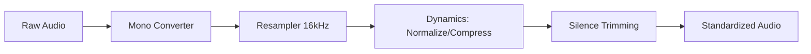

# Preprocessor Component

The Preprocessor ensures all input audio samples adhere to the strict technical requirements of the Qwen3-TTS model, ensuring consistency and preventing inference failures.

## Component Diagram

## Responsibilities
- **Channel Standardization**: Converts stereo or multi-channel audio to Mono to ensure single-speaker focus.
- **Resampling**: Adjusts the sample rate to 16,000Hz (the target rate for Qwen3-TTS).
- **Loudness Normalization**: Adjusts the peak amplitude to -3dB to prevent clipping and improve SNR.
- **Dynamic Range Compression**: Evens out the volume between soft and loud parts for more stable feature extraction.
- **Silence Removal**: Trims leading and trailing silence to minimize computational overhead during inference.
