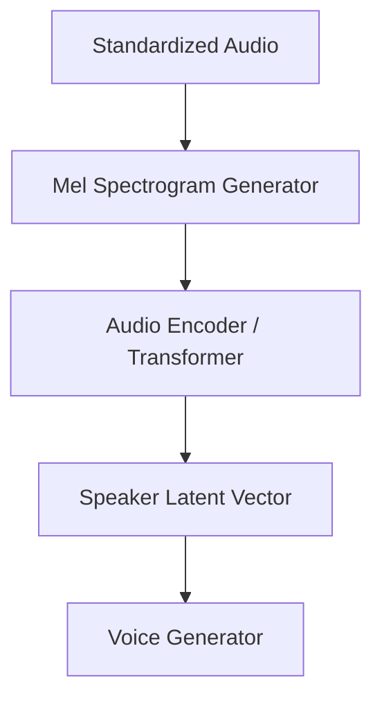

# Feature Extractor Component

The Feature Extractor identifies and encodes the unique acoustic fingerprints of the speaker from the reference audio.

## Component Diagram

## Responsibilities
- **Acoustic Transformation**: Converts raw waveform data into Mel-Spectrograms or MFCCs.
- **Latency Computing**: Projects the spectrogram features into a high-dimensional latent space (Speaker Embedding).
- **Nuance Capture**: Focuses on timbre, pace, and breathiness characteristics.
- **Dimensionality Reduction**: Compresses the complex audio signal into a compact representation suitable for the synthesis transformer.
