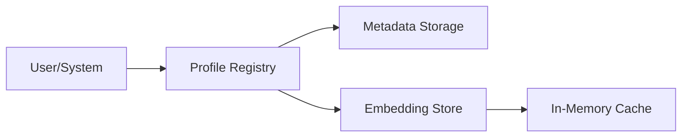

# Profile Manager Component

The Profile Manager handles the persistence and organization of speaker embeddings and associated metadata.

## Component Diagram

## Responsibilities
- **Storage**: Saves generated speaker latents for future reuse without re-extraction.
- **Metadata Management**: Associates names, languages, and quality metrics with speaker profiles.
- **Retrieval**: Quickly fetches profiles for inference based on IDs or nicknames.
- **Lifecycle Management**: Handles the creation, update, and deletion of speaker data.
