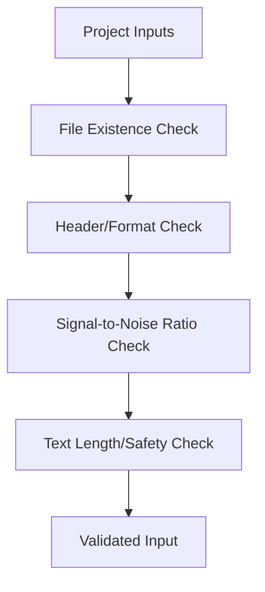

# Validator Component

The Validator ensures the integrity and quality of inputs (audio and text) before they reach the processing engine.

## Component Diagram

## Responsibilities
- **Structural Validation**: Verifies that input files are valid WAV/MP3 files and can be read by `soundfile`.
- **Quality Assurance**: Checks for excessive noise/silence or low energy in the reference sample.
- **Constraints Checking**: Ensures the target text length is within the model's token limit.
- **Dependency Verification**: Assures that required libraries (Torch, FFmpeg) are correctly configured before starting the pipeline.
