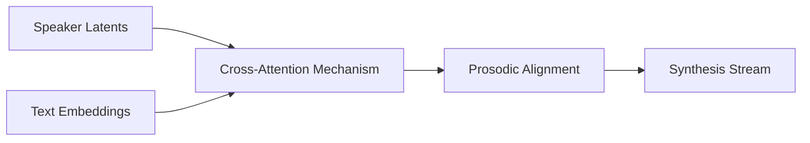

# Pattern Learner Component

The Pattern Learner utilizes the attention mechanisms within the Transformer to align the target text with the reference speaker's acoustic patterns.

## Component Diagram

## Responsibilities
- **Contextual Alignment**: Maps linguistic tokens to acoustic features of the reference voice.
- **Style Injection**: Transfers the reference's cadence and inflection onto the target message.
- **In-Context Learning**: Interprets the reference text/audio pair to "understand" the speaker's vocal characteristics without fine-tuning.
- **Consistency**: ensures the speaker's identity remains stable throughout the generated utterance.
