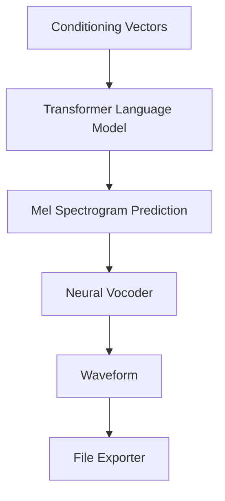

# Synthesis Adapter Component

The Synthesis Adapter handles the final translation from linguistic and acoustic representations into a playable digital waveform.

## Component Diagram

## Responsibilities
- **Utterance Generation**: Orchestrates the autoregressive generation of audio frames.
- **Vocal Reconstruction**: Uses a high-fidelity Vocoder (e.g., HiFi-GAN) to create natural-sounding speech from spectrograms.
- **Post-Processing**: Applies final de-emphasis or normalization to the generated audio.
- **Exporting**: Saves the resulting signal as a high-quality `.wav` file using `soundfile`.
