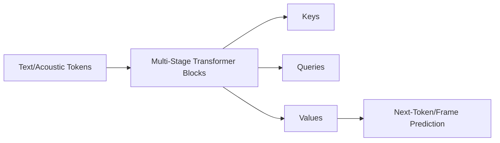

# LLM Component

The LLM (Large Language Model) block is the core intelligence of Qwen3-TTS, a transformer-based architecture capable of multi-modal understanding.

## Component Diagram

## Responsibilities
- **Semantic Understanding**: Interprets the target text for proper pronunciation and punctuation.
- **Acoustic Modeling**: predicts the sequence of acoustic features that form speech.
- **Cross-Modal Attention**: fuses text-based input with audio-based speaker prompt for zero-shot cloning.
- **Scaling**: Provides a high-capacity model (0.6B parameters) for complex vocal textures.
